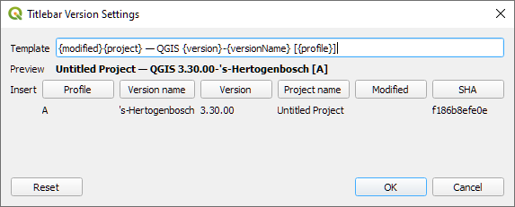

Custom TitleBar
===

This plugin allow to configure what is displayed in the QGIS title bar.

This can be useful to know at first glance which version is running when testing features across several QGIS versions.

*Copyright ©2023 Yoann Quenach de Quivillic*
